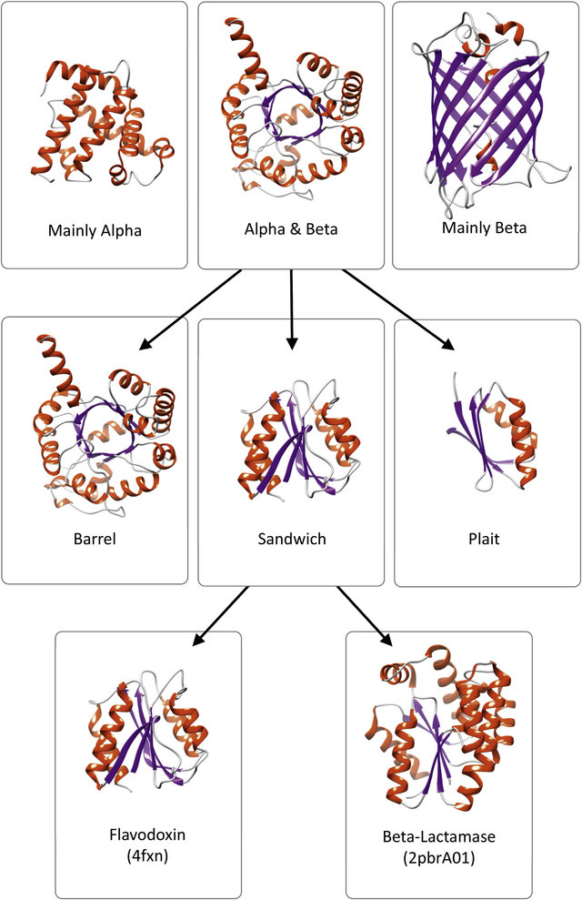

# Structural Bioinformatics

In structural bioinformatics, we deal with not just sequence but structural information from both proteins and nucleix acids. In particular, we will focus today on understanding the domains, structural motifs, etc (what we call signatures) of different proteins.

## Protein folds

We will start by having a look at proteins of different types. Following [CATH](http://dx.doi.org/10.1016/j.biochi.2015.08.004) classification:

We will work at the first three levels of classification: *Class* (based on secondary structure content), *Architecture* (based on gross spatial arrangement of secondary structures), *Topology or Fold* (similar folding arrangement of secondary structures).

Examples of proteins in different classes:

*Exercise 1.* Provide an image obtained from Chimera of the following structures:

* Mainly alpha: P69905|HBA_HUMAN
* Alpha and beta: P60174|TPIS_HUMAN
* Mainly beta: P03472|NRAM_I75A5

*Exercise 2.* Let us have a look at a characteristic alpha and beta protein: Malate dehydrogenase. Check the structure of P11708|MDHC_PIG and answer these questions:

1. what is the general organization, in your own words, of the structure of the protein? why is it said to have alpha and beta fold?

2. how many beta strabds the protein contains? Are they parallel or antiparallel? how many alpha chains?

3. Tell us what are the aminoacids that are considered hydrophobic. Using Chimera, try to locate those aminoacids in the structure of the protein. Are they where you expected them to be? What about the charged residues?

4. In Chimera, go to `Tools -> Structure Analysis -> FindHBond` and obtain an image of the hydrogen bon network of the protein. Next, focus on an alpha helix. Are the HBond where they were expected to be? Finally, check a beta sheet of the structure and answer the same question.

5. In the previous example, select only a beta sheet and later an alpha helix and show the position of the side chains of the diferent aminoacids. Are they located where they were expected to be?

## Proyein domains and motifs

Nowe we will move to analayse the protein domains of a protein. This is related mainly with evolution and with function, but of course there are specific folds associated with each domain and function.

*Exercise 3.* Retrieve the sequence of Bacillus subtilis (O32142). Search for domains/motifs using InterProScan.
1. How many domains/motifs does the sequence contain˚ ?
2. What is the relation between the two families that are returned by InterPro ?
3. Which species contain the most members of the child family ?

*Exercise 4.* Explore tyrosine kinase (Q06418|TYRO3_HUMAN). Look for the ATP binding domain using InterPro. Try to visualize it in a structure in Chimera (hint: you can use PDB: 1IRK). What type of folds the protein has? and the domains?
