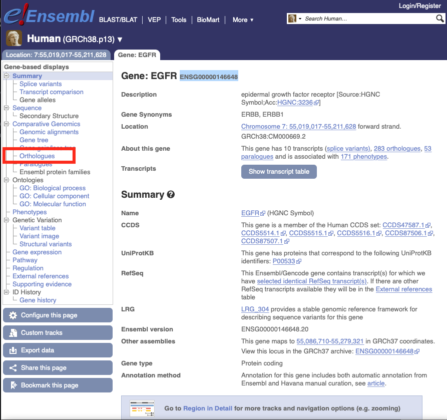
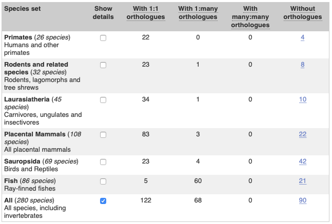
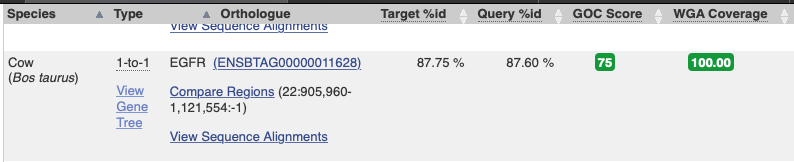
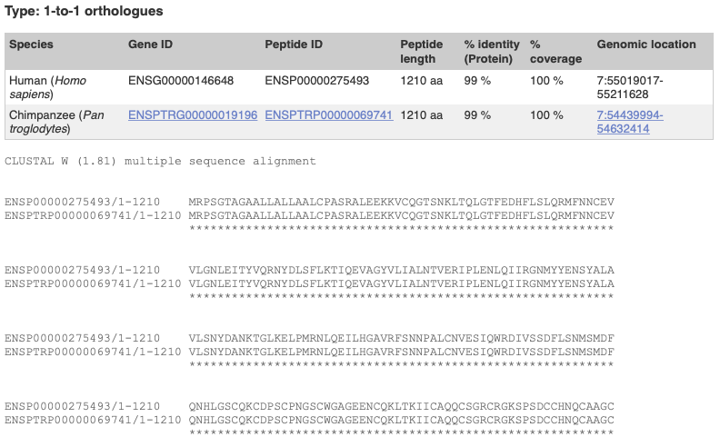
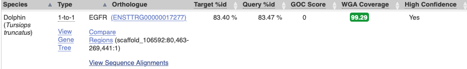
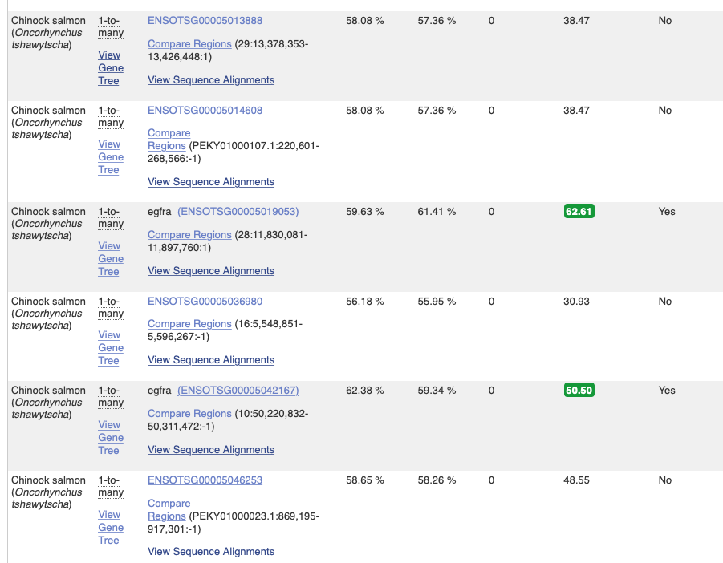
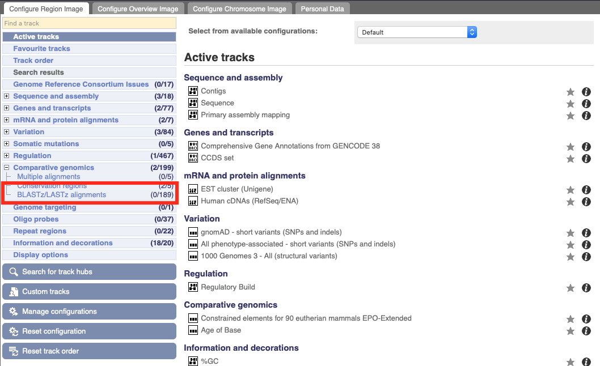
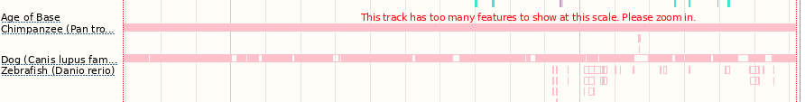
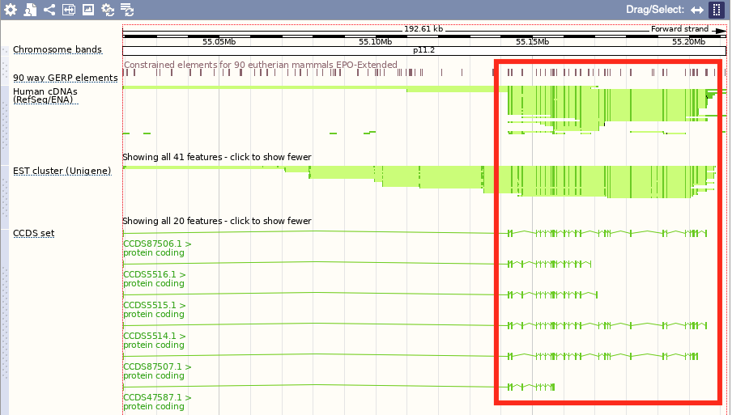

# FAQs, useful to study the subject

1. *Go to Ensembl and answer the below questions for the human gene EGFR:*
   1. *How many 1:1 (one-to-one) orthologs are predicted for this gene in sauropsida (birds and reptiles)?*

      Searching for the human EGFR gene in [ENSEMBL](https://www.ensembl.org/) we reach its [summary page](https://www.ensembl.org/Homo_sapiens/Gene/Summary?db=core;g=ENSG00000146648;r=7:55019017-55211628), corresponding the entry *ENSG00000146648*.

      Next, we cick on the `Orthologues` link in the left hand side:

      

      which leads us to a table with the number of 1:1 Orthologues for the [Sauropsida](https://en.wikipedia.org/wiki/Sauropsida) phyllum (One-to-one (1:1) pairwise orthology means that both genes in the pair have only one ortholog in the other species). As we see in the figure, there are 23 of such orthologs in the Sauropsida class in ENSEMBL.

      

   1. *What is the percentage of the human sequence matching the sequence of the orthologue in cow (Bos taurus)?*

      By searching in the same page for the cow (*Bos taurus*) EGFR **gene**, we find this information

      

      The column Query %Id shows the percentage of the orthologous sequence matching the Human sequence, in this case. So, the answer is 87.60%

   3. *Look at the protein alignment (CLUSTAL W (1.81) Multiple sequence alignment) between the human gene and its ortholog in Chimpanzee – what % of identity does the human protein? Is this what what you expected compared to cow?*

      We will, indeed, check both the **protein** alignments for chimpanzee (*Pan troglodites*) and for cow, by clicking in the `View sequence alignments` link in each of the two entries. In the case of chimpanzee, the protein alignment gyields 99% of sequence identity, as seen in this figure

      

      while doing the same exercise for the cow EGFR gene the result is 87%.

   4. *Can we rely on the orthologue predicted for Dolphin? Why?*

      Yes since this orthology relationship is classified as [High Confidence](https://www.ensembl.org/info/genome/compara/Ortholog_qc_manual.html/#hc), with high WGA Coverage and high percentage of identity. However, [GOC](https://www.ensembl.org/info/genome/compara/Ortholog_qc_manual.html/#goc) is 0, which raises some concerns about the evolutionary characteristics of the acompanying genes and opens the way for further analysis of the genomic region.

      

   5. *Has there been a significant expansion in this gene family between Chinook salmon and its most recent ancestor? How many members does Chinook salmon have?*

      Yes, there has been a significant expansion. Chinook salmon has 6 members.

      

   6. *Go to the "Region in detail" page and turn on the LASTZ-net alignment tracks (pairwaise) for chimpanzee, dog and zebrafish. Does the degree of conservation between human and the various other species reflect their evolutionary relationship?*

      We first click on the gene location ([Chromosome 7: 55,019,017-55,211,628 forward strand](https://www.ensembl.org/Homo_sapiens/Location/View?db=core;g=ENSG00000146648;r=7:55019017-55211628)). Once there, we go to the `Custom tracks` tab in the left hand side menu and choose the `BLASTz/LASTz` alignments in the `Configure Region Image` tab.

      

      There we select chimpanzee, dog and zebrafish. We can clearly see how well aligned this human gene is to chimpanzee, while the dog has some unaligned regions but the majority of regions are aligned. Zebrafish has only a couple of regions aligned.

      

      So yes, this reflects their evolutionary relationship being chimpanzee a primate/mammal, dog a mammal and zebrafish a distantly-related species.

      *Which parts of the gene seem to be most conserved?*

      It seems like the regions with positive [conservation scores](https://m.ensembl.org/info/genome/compara/conservation_and_constrained.html) mostly match up with coding sequences of this gene. However, there seems to be also conserved regions within non-coding sequences of the gene.   

      
